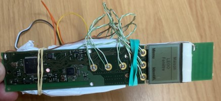
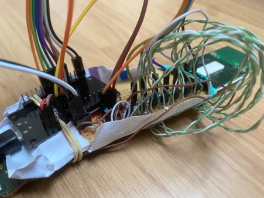
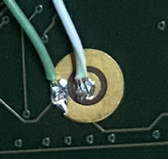

# Hack Velux remote control to connect with MQTT using .NET nanoFramework

This projects explains how to hack a Velux remote control to control your windows and connecting all this to MQTT. It adds as well an AM2320 for the temperature and humidity. All based on the beautiful [.NET nanoFramework](https://github.com/nanoFramework)!

The reason why it's using a remote control to pilot the Velux is because otherwise you need a special box that connect to your network with a set of API and then you can pilot your Velux. I just wanted to have some fun and same few hundreds euros :-)

Here are few pictures of the final solution:





The original remote control looks like this:


## Some electronic

When stripping out a remote control, be careful of screens and any elements like this. The key principle of a button is to create a contact between 2 elements, like in a physical switch. It's the exact same thing.

In the cas of my remote control, the 2 elements are round, one inside, the other outside. It's important to make sure in which direction the current is going. Equivalent of a physical switch is a saturated transistor in electronic, so that's what we will use. You can see them partially for every button on the previous picture. We will add a small resistor between the ESP32 pin and the collector to reduce the current.



## Some code

I won't comment into details the code. Just that you need to have .NET nanoFramework flashed on the device, the Visual Studio extension installed. See the [getting started here](https://docs.nanoframework.net/content/getting-started-guides/getting-started-managed.html).

## MQTT

You'll need as well a MQTT broker, I'm using [Mosquitto](https://www.mosquitto.org/).

## Home Assistant

And finally you'll need [Home Assistant](https://www.home-assistant.io/) as well. Integrate the MQTT as a platform.

You then add for each of the Velux as sensors:

```yml
# velux
- platform: mqtt
  state_topic: "velux/percent0"
  name: "Velux Salle de bain"
  icon: mdi:window-open
  qos: 0
  unit_of_measurement: "%"
```

And like this as switch:

```yml
- platform: mqtt
  name: "Velux Salle de bain"
  command_topic: "velux/action0"
  state_topic: "velux/state0"
  payload_on: "ON"
  payload_off: "OFF"
  state_on: "ON"
  state_off: "OFF"
  optimistic: false
  retain: true  
  qos: 0
```
